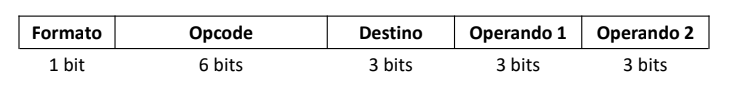
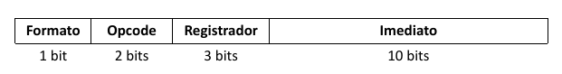

# CPU Simulator

Um simulador de processador para uma arquitetura hipotética. Esta arquitetura consiste em um processador RISC de 16 bits com dois formatos de instrução (R e I). O processador que será desenvolvido será monociclo, podendo ser atualizado para um processador pipeline.

## Arquitetura

Esta é uma arquitetura RISC (Reduced Instruction Set Computer) de 16 bits com as seguintes características:

- Todas as instruções têm exatamente 16 bits de comprimento
- Formato simples com campos em posições bem definidas
- 2 formatos de instrução: R (register) e I (immediate)
- 8 registradores de propósito geral (r0-r7)
- O bit mais significativo (bit 15) determina o formato da instrução:
  - 0: Formato R (operações entre registradores)
  - 1: Formato I (operações com valores imediatos)

### Formato R



### Formato I



## Instruções para implementação

- [x] add
- [x] sub
- [x] mul
- [x] div
- [ ] cmp_equal
- [ ] cmp_neq
- [ ] load
- [ ] store
- [x] jump
- [x] jump_cond
- [x] mov
- [x] syscall

A implementação será feita o mais próximo possível da operação real do processador, de forma funcional (não no nível de circuito), separando as diferentes etapas de processamento.


## Processador pipeline

Para a obtenção do conceito A no projeto, será necessário a implementação de um processador pipeline, com os seguintes estágios: 

- [ ] Busca de instrução
- [ ] Decodificação de instrução
- [ ] Leitura de operandos, Execução e Write-back

E também conter um preditor de desvio dinâmico.

Sugestão: implementar primeiro o modelo monociclo, e depois evoluir para pipeline.

A equipe deverá também escrever código assembly para testar o simulador.

## Etapas de Execução 

### FETCH - BUSCA DE INSTRUÇÕES

- [x] Realizado

Devemos fazer um programa que incrementa uma variável program counter, e a partir dessa variável, a gente pega a instrução que está neste índice da memória.

Ex.:
```c
program_counter = 0
instrucao = memory[program_counter]
```
    
### DECODE - DECODIFICAÇÃO DA INSTRUÇÃO
- [x] Realizado

Separa a instrução adquirida em partes definidas. Dá para usar uma struct aqui

```c
typedef struct {
    uint16_t format : 1;  // Bit 15 (bit = 0, R)
    uint16_t opcode : 6;  // Bits 14-9
    uint16_t dest : 3;    // Bits 8-6 
    uint16_t op1 : 3;     // Bits 5-3 
    uint16_t op2 : 3;     // Bits 2-0 
} r_format;
```

```c
typedef struct {
    uint16_t format : 1;  // Bit 15 (bit = 1, I)
    uint16_t opcode : 2;  // Bits 14-13
    uint16_t reg : 3;     // Bits 12-10 
    uint16_t immd : 10;   // Bits 9-0
} i_format;
```

### MEMÓRIA - ARMAZENAMENTO DA INSTRUÇÃO

### EXECUTE - EXECUÇÃO DA INSTRUÇÃO